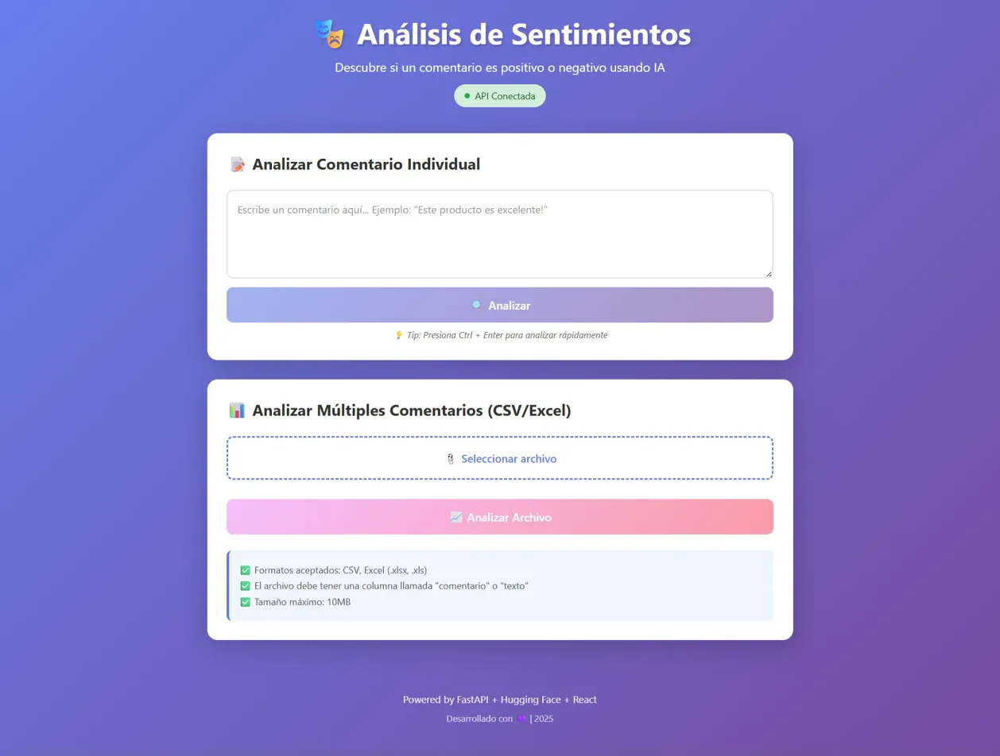
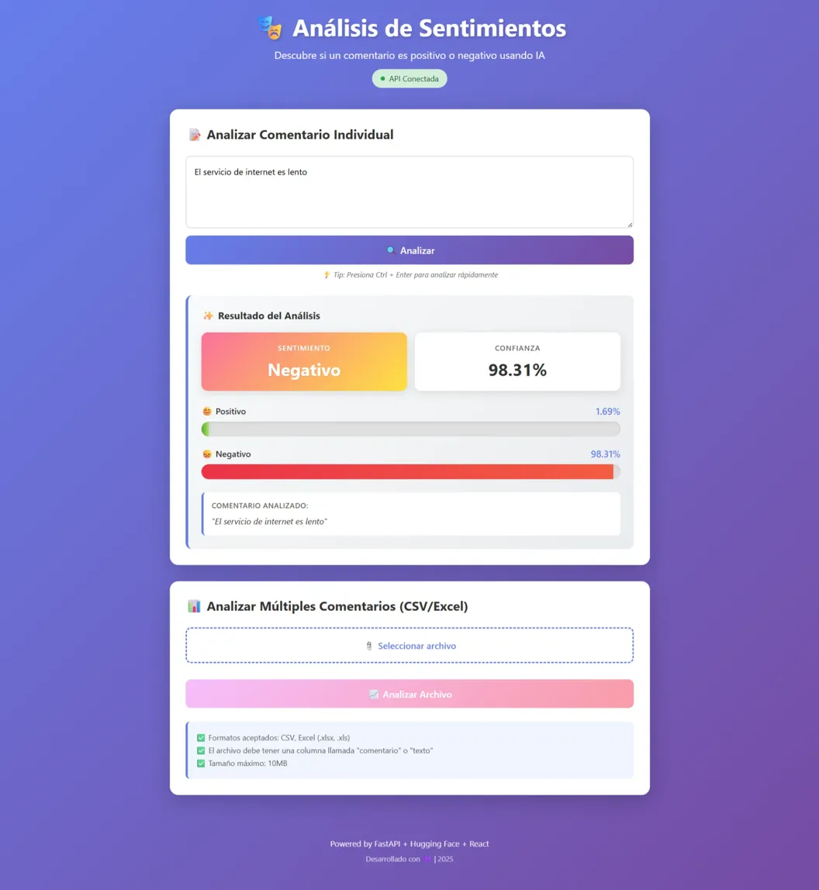
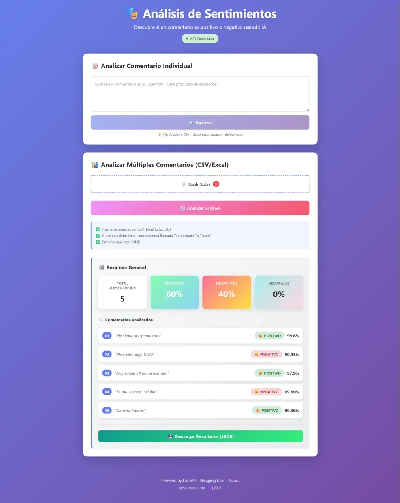

# 🎭 Análisis de Sentimientos - Frontend

Aplicación web moderna para analizar sentimientos en comentarios usando Inteligencia Artificial. Interfaz desarrollada con React + TypeScript + Vite.


## 📸 Capturas de Pantalla

### Interfaz Principal


### Análisis Individual


### Análisis por Lotes (CSV/Excel)


---

## ✨ Características

- 🔍 **Análisis Individual**: Analiza comentarios de forma rápida con Ctrl+Enter
- 📊 **Análisis por Lotes**: Sube archivos CSV o Excel con múltiples comentarios
- 📈 **Visualización en Tiempo Real**: Gráficos de porcentajes y métricas detalladas
- 🎨 **Interfaz Moderna**: Diseño responsive con gradientes y animaciones
- 💾 **Exportación de Datos**: Descarga resultados en formato JSON
- 🔄 **Estado de API**: Monitoreo en tiempo real de la conexión con el backend
- 🌐 **Soporte Multilingüe**: Optimizado para español

---

## 🛠️ Tecnologías

- **React 18** - Biblioteca de UI con Hooks
- **TypeScript** - Tipado estático para JavaScript
- **Vite** - Build tool ultrarrápido
- **CSS3** - Estilos modernos con gradientes y animaciones
- **Fetch API** - Comunicación con el backend

---

## 📋 Requisitos Previos

- Node.js 18+ y npm 9+
- Backend API corriendo en `http://localhost:8000`

---

## 🚀 Instalación

### 1. Clonar el repositorio

```bash
git clone https://github.com/GAMR11/frontend-filter-comments.git
cd frontend-filter-comments
```

### 2. Instalar dependencias

```bash
npm install
```

### 3. Configurar variables de entorno (opcional)

Crea un archivo `.env` si necesitas cambiar la URL de la API:

```env
VITE_URL_API_BACKEND=http://localhost:8000
```

### 4. Ejecutar en modo desarrollo

```bash
npm run dev
```

La aplicación estará disponible en `http://localhost:5173`

---

## 📦 Build para Producción

```bash
npm run build
```

Los archivos optimizados se generarán en la carpeta `dist/`

### Preview del build

```bash
npm run preview
```

---

## 📁 Estructura del Proyecto

```
src/
├── components/          # Componentes de React
│   ├── CommentAnalyzer.tsx    # Análisis individual
│   ├── FileAnalyzer.tsx       # Análisis de archivos
│   ├── ResultCard.tsx         # Resultados individuales
│   └── BatchResults.tsx       # Resultados batch
├── services/           # Lógica de comunicación con API
│   └── apiService.ts          # Servicio centralizado
├── styles/             # Estilos CSS
│   ├── App.css
│   ├── CommentAnalyzer.css
│   ├── FileAnalyzer.css
│   └── Results.css
├── utils/              # Utilidades y constantes
│   └── constants.ts
├── App.tsx             # Componente principal
└── main.tsx            # Punto de entrada
```

---

## 🎯 Uso

### Analizar un Comentario Individual

1. Escribe o pega tu comentario en el área de texto
2. Presiona el botón **"Analizar"** o usa `Ctrl + Enter`
3. Visualiza el resultado con porcentajes y nivel de confianza

### Analizar Múltiples Comentarios

1. Prepara un archivo CSV o Excel con una columna llamada **"comentario"** o **"texto"**
2. Haz clic en **"Seleccionar archivo"**
3. Presiona **"Analizar Archivo"**
4. Visualiza el resumen general y todos los comentarios analizados
5. Descarga los resultados en JSON

**Ejemplo de CSV:**
```csv
comentario
Este producto es excelente
No me gustó el servicio
El precio es justo
```

---

## 🔌 API Endpoints Consumidos

| Endpoint | Método | Descripción |
|----------|--------|-------------|
| `/analizar` | POST | Analiza un comentario individual |
| `/analizar-csv` | POST | Analiza archivo CSV |
| `/analizar-excel` | POST | Analiza archivo Excel |
| `/health` | GET | Verifica estado del backend |

---

## 🎨 Características de Diseño

- **Gradientes Modernos**: Paleta de colores vibrante
- **Animaciones Suaves**: Transiciones y efectos hover
- **Responsive Design**: Adaptable a móviles, tablets y desktop
- **Estados Visuales**: Loading, error y success states
- **Barras de Progreso**: Visualización intuitiva de porcentajes

---

## 🐛 Solución de Problemas

### Error: "API Desconectada"

- Verifica que el backend esté corriendo en `http://localhost:8000`
- Revisa la consola del navegador para más detalles

### Error al subir archivos

- Asegúrate de que el archivo sea CSV o Excel (.xlsx, .xls)
- Verifica que tenga una columna llamada "comentario" o "texto"
- El tamaño máximo es 10MB

### Errores de CORS

- El backend debe tener configurado CORS para `http://localhost:5173`
- Revisa la configuración en el archivo `main.py` del backend

---

## 🧪 Scripts Disponibles

```bash
npm run dev          # Modo desarrollo
npm run build        # Build de producción
npm run preview      # Preview del build
npm run lint         # Linter de código
```

---

## 🤝 Contribuir

Las contribuciones son bienvenidas. Por favor:

1. Fork el proyecto
2. Crea una rama para tu feature (`git checkout -b feature/AmazingFeature`)
3. Commit tus cambios (`git commit -m 'Add: AmazingFeature'`)
4. Push a la rama (`git push origin feature/AmazingFeature`)
5. Abre un Pull Request

---

## 📝 Licencia

Este proyecto está bajo la Licencia MIT. Ver archivo `LICENSE` para más detalles.

---

## 👨‍💻 Autor

**Gustavo Morales**
- GitHub: [@GAMR11](https://github.com/GAMR11)
- LinkedIn: [https://www.linkedin.com/in/gustavo-morales-640259221](https://www.linkedin.com/in/gustavo-morales-640259221/)

---

## 🙏 Agradecimientos

- [Hugging Face](https://huggingface.co/) por los modelos de IA
- [React](https://react.dev/) por la increíble biblioteca de UI
- [Vite](https://vitejs.dev/) por el build tool ultrarrápido

---

## 🔗 Enlaces Relacionados

- [Repositorio Backend](https://github.com/GAMR11/api-filter-comments)
- [Documentación API](http://localhost:8000/docs)
<!-- - [Demo en Vivo](https://tu-demo.com) -->

---

**Desarrollado con 💜 | 2025**